# Deconv-Resnet-Localisation-heatmaps
Playing around with putting a deconv layer on top of a resnet. Code available upon request.

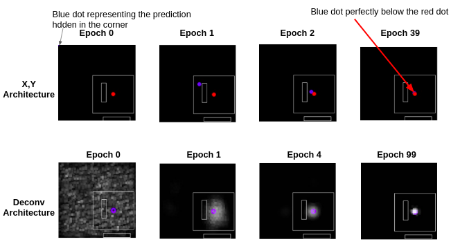

# Introduction

This project was inspired by deepLabCut (DLC) - an animal pose estimation framework. In this research paper, the authors attempt to predict locations for various animal body parts in a given frame. In my project, there are images with various number of rectangles in them and the deep learning models attempt to find the center of the largest rectangle in a given image.

# Model Architectures

DLC used a resnet50 with a deconvolutional layer at the end- this deconv-layer is responsible for producing a probability density map. This map is an image of the same dimensions as the input images and has higher values where the model thinks a certain body part might lie and lower in the rest of the image. Please note that I will use the words probability map and heat maps interchangeably.

I wanted to see how useful this density map was for my images, did I even need it? If we are just looking for a location prediction, why not just predict x,y coordinates directly instead of a probability density map? Therefore, I used two different model architectures based on resnets:

1. X,Y prediction: The first one modifies the final FC layer of a resnet to a length of 2 nodes, the first one for the x coordinate, the second one for the y. When the loss is calculated for this architecture, it is calculated between true x,y coordinates and the predicted x,y coordinates.

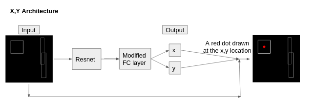

2. Heatmap prediction with Deconv layer: This network modifies the final FC layer to 2500 nodes and then puts a deconv layer after it. This deconv layer helps generate the heatmaps of size 224*224 (i.e. the size of our input images). When calculating loss here, it is calculated between a truth heatmap that we supply and the predicted heatmap. This is the model that resembles in its architecture to DLC. The idea is similar to the AE image reconstruction that we did in our class, but here instead of reconstructing the image, the model is required to construct a probability density map of where it thinks the center of the biggest rectangle might lie. 

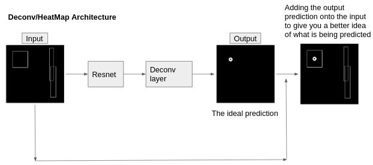

#### Loss Measure

Although DLC uses cross-entropy loss, I decided to use MSE as loss because we are dealing with continuous variables here whereas cross-entropy loss is used for categorical predictions (DLC is in fact using some fancy constrained optimisation techniques to convert their continuous variables to something like semi-continuous, semi-categorical variables which can be used with cross-entropy). 

#### Accuracy Measure

Additionally, again since we are dealing with continuous variables, the accuracy measure used by me is R2 during the hyper-parameter sweep. It is useful for the first model's 2D prediction. However, for the very high dimensional heat maps this isn't of much use. In fact, the DLC paper didn't use any such accuracy measures and used RMSE as a measure of accuracy where needed. RMSE is usually used as a loss value- so here, lower values mean better performance. I was already using MSE as the loss and decided to use log(MSE) as a measure of accuracy- log instead of a square-root conversion was used to make the ranges smaller and the numbers more comparable.

#### Other features

The number of rectangles in an image can range from 1 to 5. I will refer to images with x rectangles in them as Domain x (for example, domain 2 will refer to images with 2 rectangles in them). Please note that in the entirety of this project, any given neural net will be trained on only one given domain (i.e. the models were either trained on domain 1 or 2 or 3, but not all of domains 1, 2, 3). I chose this way because, in the DLC paper, the models were trained with only a certain number of animals as their training data (i.e. the number of mice didn't change in the given training images), and later on they were tested against datasets with a different number of animals (i.e. a model which had been trained on images with only 1 mouse was deployed against images with 3 mice).

Each domain had 10000 images. 80%, 10%, 10% was the train, val, test divide. The background of these images is black to mimic the assumption of DLC that the background is static.

# Hyperparameter sweep

For both of the model architectures, a batch size of 64, an LR of 0.001, and a depth of 18 for the resnet were considered ideal- they provided the quickest convergence to the lowest loss possible. Additionally, the first architecture (i.e. X,Y only) required around 40 epochs to flatten out, while the second (i.e. heat-map) architecture took around 100 for the given hyper-parameters. All of these sweeps were conducted on domain 3.

The relevant graphs for these hyperparameter searches can be seen at the end of this report.

# Observations

#### Predictions over epochs

For domain 3, you may see below how the predictions improved as the epoch # increased. 

For both of the architectures, a large amount of change in the first few epochs and then smaller changes in the later epochs indicates that both models learned by a large amount in the first few epochs because there was a lot to learn and then started to learn by smaller amounts as the potential of what could be learned decreased.

For the deconv architecture, please note that the number of black pixels and the brightness of non-black pixels increases with the epochs. This indicates that the model believes that the black/less-bright areas have a lesser probability of having the relevant center and the whiter/brighter regions have a higher probability.

#### Was deconv needed?

Using the X,Y only architecture seems to be doing the job well enough. But this type of architecture is very restrictive in the sense that it doesn't allow for us to make predictions for more than one center (to make predictions for than one point we will have to add more nodes to the final FC layer and retrain the entire thing). As mentioned before, one of the experiments in the DLC paper trained the model to track one mouse and deployed it against multiple mice. Surprisingly, their model was able to track all of the mice. Of course, the Deconv architecture in the example above is not predicting for more than one center, but in experiment # 3 below I was able to replicate this phenomenon by slight modifications. Please read below for more details.

# Experiments replicated

## Performace vs number of training images

The most interesting experiment conducted in the DLC paper was to see how many images does a user need to label to get a reasonable performance on the test data. They plotted the RMSE error against the number of training images. I did the same thing with domain 3 and plotted log(MSE) against the number of training images and got the following results.

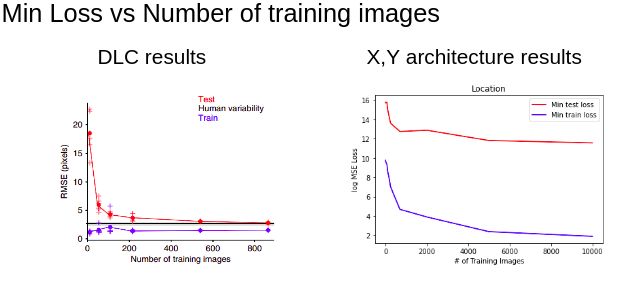

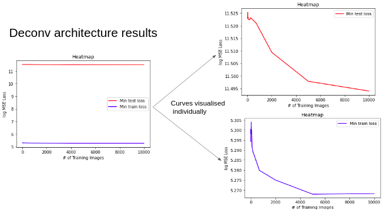

My models show a very significant flattening decrease for the train, test log(MSE) with an increase in the number of training images. My log(MSE) has a similar trend to that of DLC's, s.t. the log(MSE) decreases with an increase in training images. Additionally, in both DLC's and my results, the train curves are always lower than the test curves.

The main difference between my results and DLC's is that the latter's train-RMSE increases and decreases slightly in the beginning but then flattens out, whereas mine just keeps on decreasing.

## Performance against a different domain set

I wanted to see how my domain 3 models behaved against other domains. The log(MSE) loss against each of the domains is plotted below.

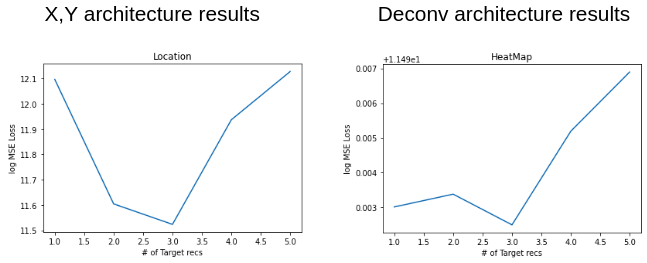

Unsurprisingly, both architectures perform the best against their own domains, indicated by the lowest value at domain 3. Except for domain 1, the performance of both architectures varies similarily, i.e. it worsens as we move further away from the training's domain. An example of how both of my domain 3 trained models failed on a domain 4 images can be seen below.

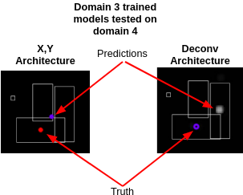

The closest thing that the DLC paper did to this is being discussed in the next "Predicting for more than one location" section.

## Predicting for more than one location

The task here is to allow the model to find locations of the centers of all of the rectangles in an image. As mentioned earlier, it is not possible to use the X,Y architecture for this problem, hence only the deconv architecture will be discussed from now on. 

Here, we won't be using any metrics to measure accuracy. Instead, we will look at the resulting probability maps and determine whether if a decent proportion of the centers was found. 

### 3 domain

In the previous sections, you have seen how the deconv-model trained on 3 domain behaves. Unfortunately, irrespective of the domain, it predicts for only one center in all of them. Hence, something else needs to be done.

### 1 domain
    
In the DLC paper, they trained on a single rat and were able to track multiple rats. How would my model behave if trained on Domain 1 and tested against the rest? All in all, these trials are somewhat successful at predicting multiple centers, however, the results are very unstable: At some runs, the models successfully predicted multiple centers, but failed to predict multiple centers for the same image at another run. And even for these multiple predictions, at most 2 centers were predicted, even when the number of rectangles present was bigger than 2. Additionally, it also completely fails to predict anything for domain 5.

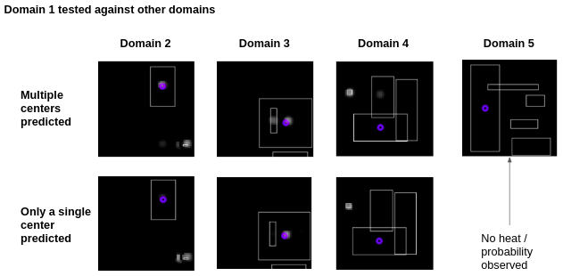

### 2 domain-Modified

Here the model was trained on domain 2 images. But, here is the tricky bit, this time we have two circles in the images: The brighter circle is for the bigger rectangle's center and the darker circle is for the smaller rectangle's.

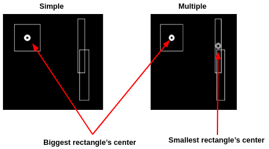

The results on different domains can be visualised below.

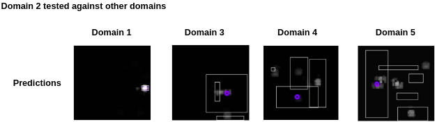

These predictions were a lot more consistent, they didn't change much over multiple runs. Overall, we have been successful at predicting multiple locations even when the train and test domains are different. The only concerning thing is that in the domain 5 rectangle, we are making a lot of wrong predictions, i.e. predicting at locations outside of any rectangle.

## Does training for more labels per image lead to lower error?

   The idea is that if we train for more variables, the neural net will be able to understand more of the variance in our image (i.e. a system trained to identify both the tail and the snout of a rat should have a higher understanding of the images and therefore a higher accuracy at finding snouts than a system which is only trained to see the snouts). The DLC paper checked the snout-/tails' RMSE error of a model trained on snout-/tail only data vs when it had been trained on both the tail and snout. The errors were lower when more parts of the rat's body were labeled.
   
   The domain 2 models (i.e. 2 domain deconv-simple and deconv-modified) provide an ideal candidate for this. They were tested against domain 1. The idea is to see if the modified 2 domain model has a better performance at finding the rectangle's center than the simple 2 domain model. I only plotted the test log(MSE).

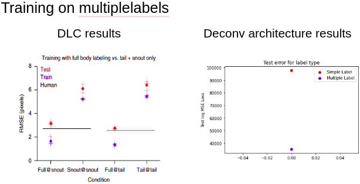

My results are similar to DLC's. Having more labels (i.e. the modified deconv indicated by the blue labels) does lead to the errors being lower than the case with a lesser number of labels (i.e. the simpler deconv indicated by the red lines).

# Concerns, Things not replicated, Possible Improvements

As mentioned before, DLC uses some fancy contrained optimisation techniques from the DeeperCut framework which I didn't attempt to replicate. Additionally, I also didn't replicate their experiment on how differences in multiple human labels (ex. people might label tails/snouts to be at slightly different locations) might affect the overall prediction of their model. 

Additionally, while labeling their data, instead of randomly selecting images to label, they used to label k centers from the k-means algorithm. I also didn't replicate this in my code.

Also, the data supplied to the heat-map model architecture isn't a true probability density. It is a circle of a uniform brightness around the center of the rectangle. A true probability density should have been highest at the x,y coordinates of the center and should have decreased in intensity as we went away from these coordinates. The only reason not for adopting this method were the limits imposed by the OpenCV library. A custom python function written by me would have slowed down everything by a significant amount.

# References

1. Mousemotorlab.org
2. DeepCut: Joint Subset Partition and Labeling for Multi Person Pose Estimation
3. DeeperCut: A Deeper, Stronger, and Faster Multi-Person Pose Estimation Model
4. DeepLabCut: markerless pose estimation of user-defined body parts with deep learning
5. Using DeepLabCut for 3D markerless pose estimation across species and behaviors

# Hyperparameter Sweep Graphs

## X,Y architecture 

### Batch Size

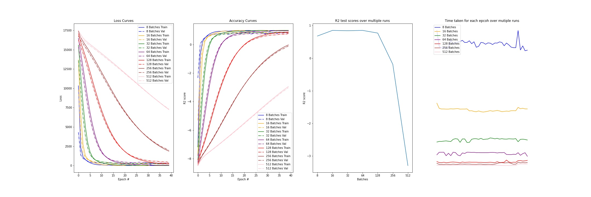

### Learning Rates

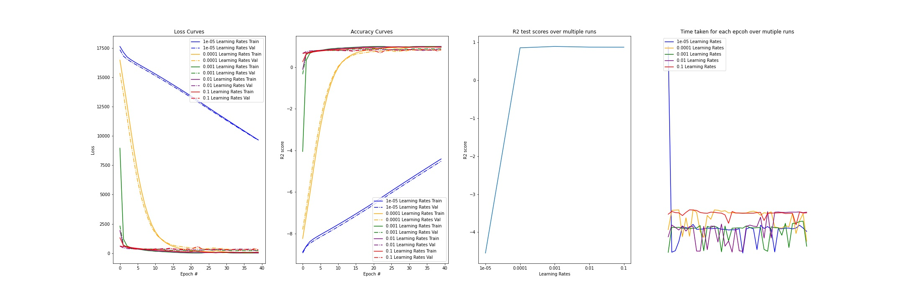

### Model Depth

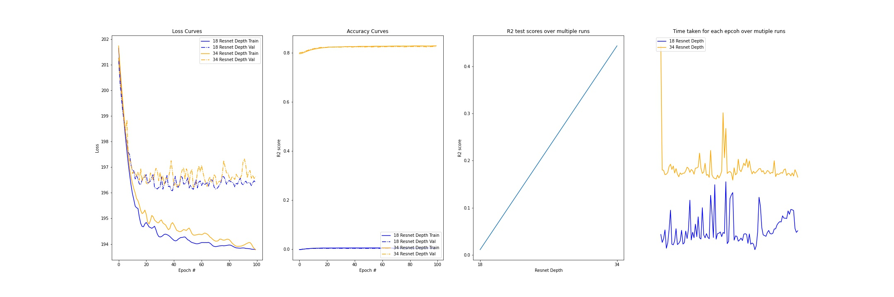

## Deconv Archictecture

### Batch size

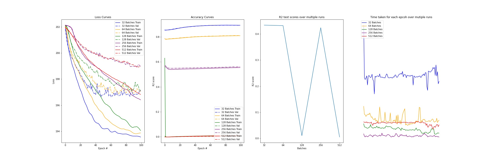

### Learning Rates

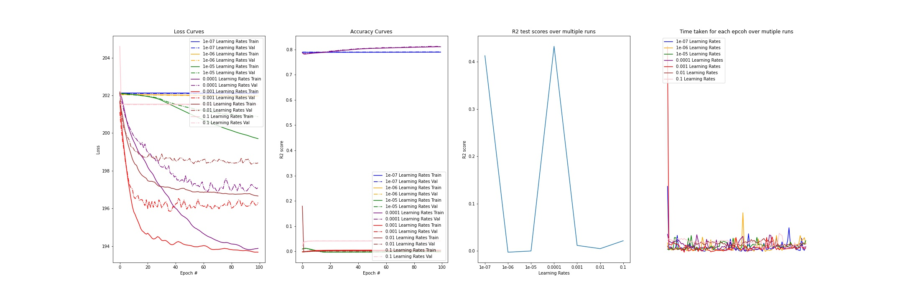

### Resnet Depth

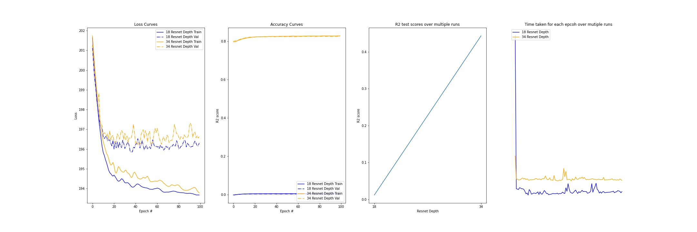
